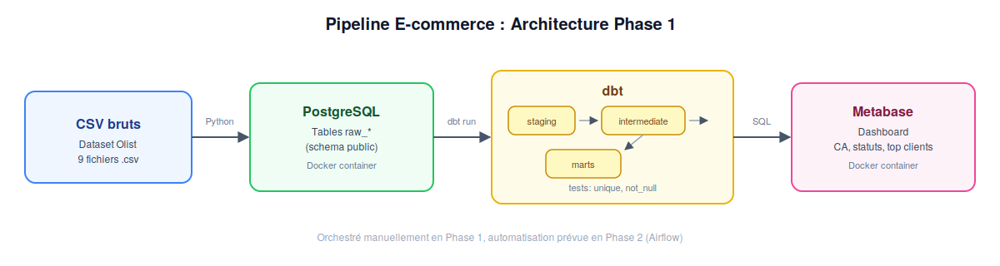

# Pipeline de données E-commerce

Projet personnel réalisé en parallèle de mon Master Data Science, pour compléter ma formation et développer des compétences de Data Engineer. Ce n'est pas un projet académique noté ni demandé dans le cadre de mes cours : c'est une initiative personnelle pour construire un portfolio concret. Il simule un pipeline de données de bout en bout pour une plateforme e-commerce : ingestion de données brutes, transformation via dbt, et visualisation dans un dashboard.

Le projet est construit en plusieurs phases progressives (voir [Roadmap](#roadmap)). Ce README documente l'état actuel : Phase 1 (pipeline batch) et Phase 2 (orchestration Airflow), toutes deux terminees.

## Objectif

Construire un pipeline reproductible qui transforme des données brutes de commandes e-commerce en tables analytiques prêtes à l'emploi, avec tests de qualité de données et dashboard de suivi des KPIs métier (chiffre d'affaires, statuts de commandes, top clients).

## Architecture



```
CSV bruts → PostgreSQL (raw) → dbt (staging → intermediate → marts) → Metabase (dashboard)
```

1. **Ingestion** : les fichiers CSV du dataset sont chargés tels quels dans des tables `raw_*` PostgreSQL via un script Python. Le chargement est idempotent : les tables sont vidées (`TRUNCATE`) puis réinsérées, sans jamais être supprimées, pour ne pas casser les vues dbt qui en dépendent.
2. **Transformation (dbt)** : les données brutes sont nettoyées et modélisées en 3 couches :
   - `staging/` : renommage, typage, nettoyage basique (1 modèle par table source)
   - `intermediate/` : jointures logiques entre entités (ex. commandes + paiements)
   - `marts/` : tables finales orientées métier (faits et dimensions)
3. **Qualité des données** : tests dbt (`unique`, `not_null`) sur les clés et colonnes critiques.
4. **Orchestration (Airflow)** : un DAG planifié quotidiennement (`@daily`) enchaîne les 3 étapes ci-dessus (`load_raw_data`, puis `dbt_run`, puis `dbt_test`), avec retries automatiques (2 tentatives, 5 min d'intervalle) en cas d'échec.
5. **Visualisation** : dashboard Metabase connecté directement au schéma `analytics`.

## Stack technique

| Composant | Outil |
|---|---|
| Conteneurisation | Docker / Docker Compose |
| Base de données | PostgreSQL 16 |
| Transformation | dbt (dbt-core 1.8, dbt-postgres 1.8) |
| Orchestration | Apache Airflow 2.9 (LocalExecutor) |
| Visualisation | Metabase |
| Ingestion | Python (pandas, SQLAlchemy) |

## Dataset

[Brazilian E-Commerce Public Dataset by Olist](https://www.kaggle.com/datasets/olistbr/brazilian-ecommerce) : environ 100 000 commandes passées entre 2016 et 2018 sur la marketplace brésilienne Olist. Le dataset est composé de 9 fichiers CSV reliés entre eux (commandes, clients, produits, paiements, avis, vendeurs, géolocalisation).

## Structure du projet

```
ecommerce-pipeline/
├── data/raw/                          # CSV bruts (non versionnés, voir .gitignore)
├── docker/
│   └── docker-compose.yml             # PostgreSQL, Airflow, Metabase
├── airflow/
│   ├── Dockerfile                     # Image Airflow avec dbt et dépendances pré-installées
│   ├── dags/
│   │   └── ecommerce_pipeline_dag.py  # DAG : load_raw_data -> dbt_run -> dbt_test
│   ├── logs/
│   └── plugins/
├── ingestion/
│   └── load_raw_data.py               # Chargement des CSV vers PostgreSQL (idempotent)
├── dbt_project/
│   ├── profiles.yml                   # Profil dbt utilisé par le conteneur Airflow
│   └── ecommerce_dbt/
│       ├── models/
│       │   ├── staging/               # stg_orders, stg_customers, stg_payments...
│       │   ├── intermediate/           # int_orders_with_payments
│       │   └── marts/                  # fct_orders, dim_customers, dim_products
│       └── dbt_project.yml
├── notebooks/
│   └── exploration.ipynb              # Exploration initiale des données
├── docs/
│   ├── architecture.png
│   └── screenshots/                   # Captures d'écran du dashboard et du DAG
└── README.md
```

## Modèles de données

**Staging** (`stg_*`) : une vue par table source, avec typage et nettoyage minimal.

**Intermediate** :
- `int_orders_with_payments` : jointure commandes / paiements

**Marts** :
- `fct_orders` : table de faits : une ligne par commande, avec le montant total payé
- `dim_customers` : dimension client
- `dim_products` : dimension produit

**Tests de qualité** : unicité et non-nullité des clés primaires (`order_id`, `customer_id`, `product_id`) sur les tables de marts.

## Installation et exécution

Prérequis : Docker, Python 3.9+, un compte Kaggle pour télécharger le dataset.

```bash
# 1. Cloner le repo
git clone <url-du-repo>
cd ecommerce-pipeline

# 2. Télécharger le dataset dans data/raw/
kaggle datasets download -d olistbr/brazilian-ecommerce
unzip brazilian-ecommerce.zip -d data/raw/

# 3. Construire l'image Airflow (dbt et dépendances pré-installées)
cd docker
docker-compose build

# 4. Initialiser Airflow (crée la base de métadonnées et l'utilisateur admin)
docker-compose up airflow-init

# 5. Lancer tous les services (PostgreSQL, Airflow, Metabase)
docker-compose up -d

# 6. Ouvrir Airflow, activer le DAG et le déclencher manuellement
# http://localhost:8080 (login: admin / mot de passe: admin)
# Une fois activé, le DAG "ecommerce_pipeline" s'exécute automatiquement chaque jour.

# 7. Accéder au dashboard
# Ouvrir http://localhost:3000 et se connecter à PostgreSQL
# (host: postgres, port: 5432, db: ecommerce, user/pass: dataeng)
```

## Orchestration avec Airflow

Le DAG `ecommerce_pipeline` automatise l'ensemble du pipeline, sans intervention manuelle :

```
load_raw_data → dbt_run → dbt_test
```

- **Planification** : quotidienne (`@daily`)
- **Retries** : 2 tentatives automatiques, avec 5 minutes d'intervalle, en cas d'échec d'une tâche
- **Isolation** : Airflow utilise sa propre base de métadonnées PostgreSQL (`airflow_postgres`), séparée de la base métier, pour respecter les bonnes pratiques
- **Idempotence** : `load_raw_data.py` vide et réinsère les données (`TRUNCATE` + `INSERT`) plutôt que de supprimer les tables, ce qui évite de casser les vues dbt qui en dépendent lors des exécutions suivantes

## Dashboard

Le dashboard Metabase regroupe trois analyses principales :

1. **Chiffre d'affaires par mois** : évolution du CA à partir de `fct_orders`
2. **Répartition des commandes par statut** : suivi opérationnel
3. **Top clients par montant dépensé** : jointure `fct_orders` × `dim_customers`

*(captures d'écran disponibles dans `docs/screenshots/`)*

## Difficultés rencontrées et apprentissages

- Configuration du fichier `profiles.yml` de dbt : bien distinguer sa localisation (`~/.dbt/`, hors du projet) de `dbt_project.yml` (dans le projet), et vérifier que le mot de passe n'est pas resté vide après une saisie interactive interrompue.
- Sensibilité de l'indentation YAML dans `docker-compose.yml` : un service mal placé sous la mauvaise clé (`volumes` au lieu de `services`) fait échouer toute la configuration.
- Suppression du dossier `models/example/` généré par défaut par `dbt init`, qui pollue les runs et tests si on ne le retire pas dès le départ.
- Dans Metabase, la connexion à PostgreSQL depuis un autre conteneur Docker se fait via le nom du service (`postgres`), pas via `localhost`. Le même principe s'applique dans Airflow : le script d'ingestion doit utiliser `postgres` (nom du service), pas `localhost`, une fois exécuté dans un conteneur.
- `_PIP_ADDITIONAL_REQUIREMENTS` (installation de paquets Python au démarrage d'Airflow) est fragile et lent : la compilation de `psycopg2` échoue sans les outils système nécessaires (`build-essential`, `libpq-dev`). Une image Docker personnalisée (`airflow/Dockerfile`), avec les dépendances installées une seule fois à la construction, est bien plus fiable.
- Sans version épinglée, l'installation de dbt peut récupérer une version récente où l'adaptateur PostgreSQL est marqué expérimental. Épingler `dbt-core` et `dbt-postgres` à la même version évite ce problème.
- `pandas.to_sql(..., if_exists="replace")` supprime puis recrée la table : ça échoue dès qu'une vue dbt en dépend. Remplacer par un `TRUNCATE` suivi d'un `INSERT` (`if_exists="append"`) rend le script réellement rejouable, ce qui est indispensable pour un DAG planifié.

## Roadmap

[#roadmap](#roadmap)

- [x] **Phase 1** : Pipeline batch, CSV → PostgreSQL → dbt → Metabase
- [x] **Phase 2** : Orchestration du pipeline avec Airflow (scheduling, retries, alerting)
- [ ] **Phase 3** : Ingestion en temps réel avec Kafka/Redpanda + traitement PySpark Structured Streaming
- [ ] **Phase 4** : Monitoring (Prometheus/Grafana), tests automatisés, CI/CD (GitHub Actions), déploiement cloud (Terraform)

## Auteur

Yanis, Master Data Science, projet personnel pour se former à la Data Engineering.
